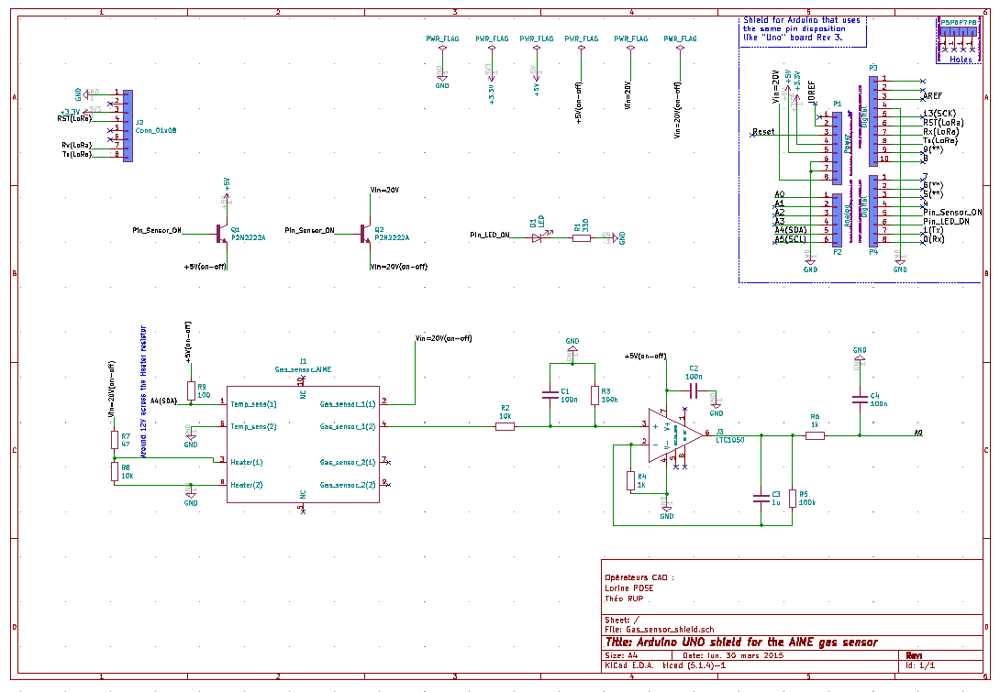
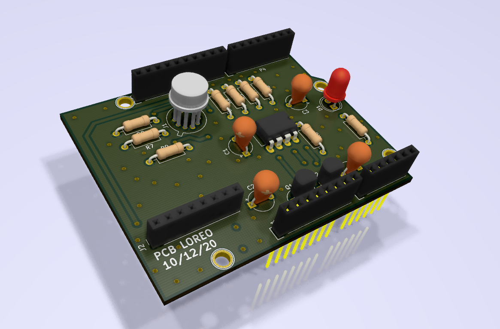

# 2020-2021_Pose_Rup
Shield comportant un capteur de gaz développé à l'AIME pour la Arduino UNO

## SMALL DESCRIPTION
Ce shield permet l'exploitation directe de la mesure du gas dans un pièce grâce au capteur de gas développé en salle blanche à l'AIME.
Une LED rouge permet de prévenir lutilisateur d'une trop mauvaise qualité de l'air.
Un espace a été spécialement réservé pour inclure la carte de développement du module RN2483A de drazzy.com.

---

## INCLUDE IN THE DESIGN

- [x] Gas sensor réalisé à l'AIME
- [x] Capteur de température pour mesurer la température opérationelle du capteur de gas
- [x] Circuit de traitement et amplification du signal du capteur de gas
- [x] LED rouge pour prévenir l'utilisateur d'un danger / mauvaise qualité de l'air
- [x] Socket pour venir fixer la carte intégrant le module LoRa et son antenne
- [x] 2 transistors N-MOSFET permettant de passer le capteur en "sleep mode" en utilisant le pin 3 de l'Arduino

---

## Tools used

### KiCad

[KiCad EDA - Schematic Capture & PCB Design Software](https://kicad-pcb.org/), version: 5.1.7

Open source EDA / electronics CAD software for Windows, macOS and Linux.

## Electrical diagram

## Components placement

## 3D view

